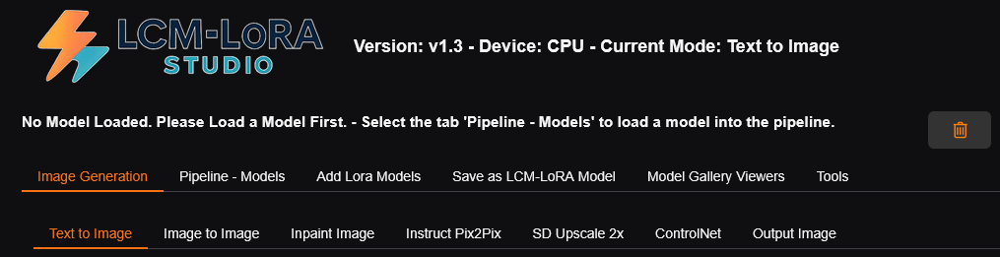
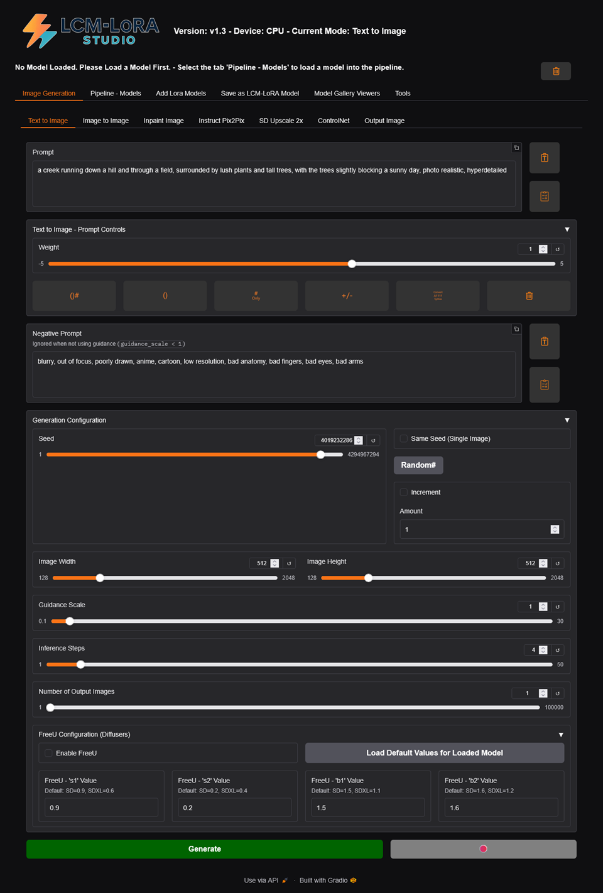
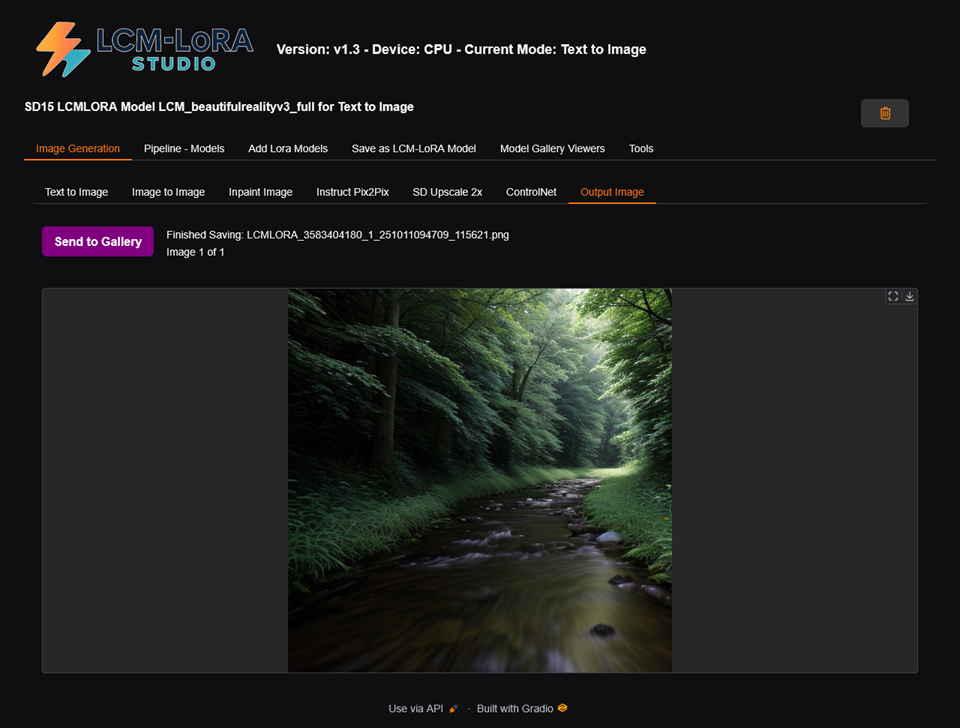
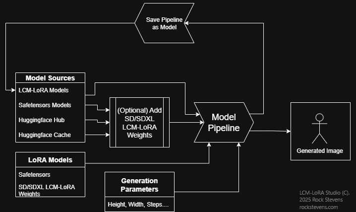

<A id="top"></a>
# LCM-LoRA Studio
 Version 1.3a
  
  
  
<a id="introduction"></a>
## Introduction

***Create a high-quality image, in an average of ONLY 4 STEPS, using just a low-end CPU or a Raspberry Pi 5.***  
  
At it's basic core it generates images using common 
StableDiffusion techniques. However add an LCM-LoRA to the base model and this enables a 4 Step inference 
to generate images. This shorter number of steps allows us to generate images faster than the nomal 20-50 
step de-noising process. LCM-LoRA Studio was mainly written for PC's with no good GPU, and the 
Raspberry Pi 5 (both 8GB and 16GB versions) as a first step, in order to reduce inference time while 
still generating high-quality images.  
And to create special LoRA 'baked-in' types of models, in an, 'all-in-one' application.   
  
## Note: This will currently not install on a Raspberry Pi5 with the lastest Raspberry Pi OS installed (Trixe).  
It should install on previous repleases. And on Windows 10/11.   

This issue is currently being solved, and will update on progress, once the issue is closed.
  
**Advantages:**
* Greatly reduces image generation time.
* Save loaded Pipeline as a New Model.
* Works with most existing fine-tuned Stable Diffusion SD/SDXL models, including custom checkpoints and other LoRAs.
* Can be used with other LoRAs to generate specific styles or add structural guidance, with very little to no difference in inference speed.
* Can function 100% Offline ! (Once you have downloaded all the needed models.)
* CPU with only 8G RAM for SD ! (16G RAM for SDXL)
* With just a Raspberry Pi5 -OR- a modest computer with 8G RAM. You can generate great looking images.
  
  
**Design:**  
This app is designed to address 2 issues that exist.  
1. I do not have a good GPU.  
2. I do not have a high-end PC with tons of RAM.  
  
  
<a id="qindex"></a>
## Quick Index
* [Introduction](#introduction)
* [Quick Index](#qindex)
* [YouTube Videos](#youtube)
* [Text to Image Screenshot](#t2ishot)
* [Output Image Screenshot](#outshot)
* [Summary](#summary)
* [Block Diagram Model - Pipeline](#block-diagram)
* [LCM-LoRA Studio Features](#features)
* [Performance](#performance)
* [Requirements](#requirements)
* [Installation](#installation)
* [Run](#run)
* [Run (LOOP) Version](#loop-version)
* [Acknowledgements / Credits](#credits)
* [Disclaimer](#disclaimer)
* [License](#license)

---

<a id="youtube"></a>
### YouTube Videos 

[Install of LCM-LoRA-Studio on a Raspberry Pi 5](https://youtu.be/PXEmXvmkqdQ)  
[Realtime Run of LCM-LoRA-Studio on a Raspberry Pi 5 from Command Line](https://youtu.be/0nEvR0uNlMo)  
[Demo of the Restart feature in LCM-LoRA-Studio on a Raspberry Pi 5](https://youtu.be/pGscdxQ_vGA)  
[Install of LCM-LoRA-Studio on Windows](https://youtu.be/8WwrtT_DEMc)  
[First Run of LCM-LoRA-Studio on Windows](https://youtu.be/4AfTc6sMogY)  

<br>

[Back to Top](#top) | [Quick Index](#qindex)

<a id="t2ishot"></a>
### Text to Image Screenshot 


<br>

[Back to Top](#top) | [Quick Index](#qindex)


<a id="outshot"></a>
### Output Image Screenshot

<br>

[Back to Top](#top) | [Quick Index](#qindex)

---

<a id="summary"></a>
## Summary
In essence, Load a SD/SDXL model into the LCM-LoRA Studio 'Pipeline', add the LCM-LoRA Weight to the 'Pipeline', 
then you can generate an image in ONLY 4 STEPS. Then, if you like the results, 
Save the 'Pipeline' as a New LCM-LoRA Model. Or add additional LoRA models for various fine-tuning tasks, 
and Save that model as well.   
See the block diagram below.

<a id="block-diagram"></a>
## Block Diagram Model - Pipeline



<br>

[Back to Top](#top) | [Quick Index](#qindex)


<a id="features"></a>
## LCM-LoRA Studio Features

**Image Generation (SD/SDXL)**
* Text to Image
* Image to Image
* Inpainting
* Instruct Pix2Pix
* Image Upscaling - SD Upscaler 2x
* SD ControlNet (*Use up to two ControlNets at once !!) MLSD Line Detection, HED Edge Detection, Depth Estimation, Scribble, Canny, Normal Map Estimation, Image Segmentation and OpenPose.*)  

  
**Prompts**
* Both Prompt and Negative prompt inputs.
* Embedded Prompts (Can be adjusted in settings.)
* Prompt Weighting (uses the 'Compel' prompt weight library, also can be adjusted in settings.)
* Prompt token length checking.
* Paste Prompt Button, loads prompt from OS clipboard.

**General Image Generation**
* Live Inference Progress Bar During Generation. Shows Time, Current Inference Step.
* Access the Diffusers 'FreeU' configuration settings, to tweak for various generation changes.
* Seed - Single Images: Start on the selected seed, Start on a random seed.
* Seed - Multiple Images: Same as Single Image -OR- increment seed up or down by X amount.
* Generate a LARGE number of images when Generating Multiple Images.
* Clip Skip (SD)
* Uses Safety Checker via an Image Classification Model. (which can be disabled in settings if needed)
* Auto Jump to 'Output Image Tab' when you click the 'Generate' button.
* Saves Generation text-parameter file with generated image (PNG).

  
**Models - Pipeline**
* Load SD and SDXL Local Previously Saved LCM-LoRA Models
* Load SD and SDXL Local Huggingface 'Cache' Models - Auto filters out all non SD/SDXL models. (No LLMs, etc...)
* Load SD and SDXL Huggingface Models (You can grab just the files needed, and it will load the model directly into the 'Pipeline', or the 'whole repository')
* Load SD and SDXL Safetensors Models - Single File Safetensors Models - From Huggingface, Civitai etc...
* Load SD and SDXL LoRA Models - Single File Safetensors Models - From Huggingface, Civitai etc...
* Load a seperate text encoder than the loaded model uses. (LCM-LoRA, SD)
* Use 'Reference' Models and/or 'Original Config' Files when Loading Safetensors Model files to guide loading. (See settings)

**LoRA**
* Load the LCM-LoRA Weights and then save the Pipeline as an LCM-LoRA Model for the faster '4 step inference'.
* Auto (optional) Load/Apply the LCM-LoRA Weights when loading models, or Load without the LCM-LoRA Weights.
* Load (Add) 'multiple' LoRAs directly into the pipeline.
* Change any loaded LoRAs weights, individualy.
* "Bake" or "Merge" a LoRA into the Pipeline, then Save as an LCM-LoRA Model.
* Load and Save the Model Pipeline. With or without LoRA weights.

**General Features**

* 'Simple OpenPose Editor' Opens in a new window (tab). 100% Offline, Pure HTML/JavaScript. Saves PNG images for use with  OpenPose/ControlNet.
* Multi-Step Image Proccessing Section 
* Tweak/Enhance Images Before and/or After Generation). Including: Adjust Brightness, Contrast, Color, Individual R/G/B Weight on Images
* Convert to Grayscale - Adjusting Upper/Lower Thresholds, Individual R/G/B Weights, Invert GrayScale
* Post Processing Edge Detection (Use for some of the ControlNets). Canny, Laplacian, Scharr, Sobel, Simple Gradient, Prewitt, Roberts Cross.
* Processed Output Image can be Inverted as well as apply Sharpening.
* Save processed image at any step.
* Apply Gaussian, Horizontal and/or Vertical Motion Blur at any stage of image processing.
* Send Proccessed Output Image Directly to either of the 2 ControlNet Image Input controls. (Then Switches to the ControlNet Tab.)
* Access many 'Settings' which control LCM-LoRA Studio, as well as some of the backend and how models are loaded/handled.
* Enable 'Use Authenticaion'. (Require a Login.)

<br>

**Programmers/Hacking Features**<br>
* Very easy to add settings to program, see 'config.py'
* Choose between Textbox, Slider, Number, Checkbox, HTML and Label as 'Input' types in the Setting UI.
* Written as an example of 'simple python coding' image generation. Basically in a 'canned code' type format like some compilers I've written. 
* Lots of comments throughout. (unless kinda obvious what it does.)
<br>

[Back to Top](#top) | [Quick Index](#qindex)

 
---

<a id="performance"></a>  
## Performance

**Model**: Original Stable Diffusion Base (SD) v1.5  
**LoRA**: SD15 LCM-LoRA added to model with weight of 1.0  
**Image Size**: 512 x 512   
**CFG**: 1.0  
**Prompts**: Normal, no embedded prompts.  
<br>

| Operating System  | CPU                                   | RAM | Storage Type      | Time per iter | Total time | SD Model / Prec |
|-------------------|---------------------------------------|-----|-------------------|---------------|------------|-----------------|
| Windows 10 Pro    | Intel(R) Core(TM) i5-12500T @ 2.00GHz | 16G | USB 3.0 FLASH     | 6.34 s/it     | 48 s       | LCM-LoRA / FP16 |
| Windows 11 Pro    | Intel(R) N95 @ (1.70 GHz)             | 8G  | USB 3.0 SSD       | 8.23 s/it     | 53 s       | LCM-LoRA / FP16 |
| Windows 11 Pro    | Intel(R) N95 @ (1.70 GHz)             | 16G | USB 3.0 SSD       | 8.04 s/it     | 53 s       | LCM-LoRA / FP16 | 
| Raspberry Pi OS   | Raspberry Pi 5                        | 8G  | Class10 SDCARD    | 14.61s/it     | 77 s       | LCM-LoRA / FP16 |
| Raspberry Pi OS   | Raspberry Pi 5                        | 16G | PCIe 2.0 NVMe SSD | 13.19s/it     | 71 s       | LCM-LoRA / FP16 |

*Inference time always goes up if there is an increase in, Image Size or CFG Scale, and SDXL models always take longer than SD models.*   
*'Time per iter' comes from the 'diffusers' progress bar.*  
*'Total time' comes from LCM-LoRA Studio. Starts when inference begins, Stops once the image is saved.*  

On MY Windows 10/11 systems I run a 'Pure Portable Python/AI System' off of an External USB 3.0 SSD, that I created which never touches the Windows Hard Drive. :) Everything, Python, Git, FFMPEG, mingw64 and more..., Models, Huggingface Cache, Gradio Cache, TEMP folders, PIP and it's Cache, Source, Docs... Everything.  
So it has to load Python, the libraries/imports, models ALL through the USB bottleneck. :(  
I'll probably release details on that in a seperate repo or something at a later date once I'm done with this project, with it all packaged up and doc'd.  

So, with...  
1. Python actually installed on your system.  
2. And, with the No USB bottleneck I get because of my particular setup.  
  
It should perform faster on your system than my system (with same CPU/Speed/RAM etc..), mainly in the 'loading', 'saving' models area and other storage intensive tasks.  

<br>

[Back to Top](#top) | [Quick Index](#qindex)

  
---

<a id="requirements"></a>
## Requirements

To install, ensure you are connected to the internet for installation of Python packages not in your pip cache, etc... 
Then later of course to download models, after that, it can work 100% Offline.  

* Good Internet Connection
* Windows 10 or higher, Raspberry Pi 5 OS (Linux)
* Minimum Python version 3.10.8 (NOTE: Installer does not check version, only if Python exists)
* CPU system with at least 8 GB RAM for SD models ONLY -OR- at least 16GB to do BOTH SD and SDXL Models.
* Modern web browser for the user interface.


<br>

[Back to Top](#top) | [Quick Index](#qindex)

 
---

<a id="installation"></a>
## Installation

* Download LCM-LoRA-Studio from GitHub, and unzip to a folder where you want it installed.

<br>

#### Windows Install

LCM-LoRA Studio can be installed right from Explorer.  
Just navigate to the LCM-LoRA Studio folder and double-click:

```commandline
install.bat
```

<br>

#### Raspberry Pi 5 Install

Open a terminal and navigate to the directory you unzipped 'LCM-LoRA Studio' to.  
In the terminal type the following 2 command lines:

```shell
chmod +x *.sh
./install.sh
```

<br>

On both Windows and the Raspberry Pi 5, LCM-LoRA Studio installer will install the needed Python packages in order to run the app.  
After installation of all of the packages, LCM-LoRA Studio will be ready to run.

<br>

[Back to Top](#top) | [Quick Index](#qindex)


---

<a id="run"></a>
## Run LCM-LoRA Studio

<br>

#### Run Windows Version
To Run LCM-LoRA Studio, it is the same as the installation, from Explorer.  
Just navigate to the LCM-LoRA Studio folder, but double-click:

```commandline
run.bat
```

<br>


#### Run Raspberry Pi 5 Version
To Run LCM-LoRA Studio, In the terminal type the following command line:

```shell
./run.sh
```

<br>


On 'first-run', the app will go to Huggingface and download the 'Image Classifier' model used in LCM-LoRA Studio. 
(unless already in your Huggingface Hub Cache). This is done to ensure the location, ie... path exists before LCM-LoRA Studio gets going, because they need to exist. 
(I've had some instances that the enviroment variable for the Hub Cache folder 'HF_HOME' nor the 'HF_HUB_CACHE' existed until there is something downloaded.) 
And, LCM-Lora Studio needs it, so we can later load a model from the cache via a simple dropdown inside the app.
The Image Classifier model, seeds the Hub Cache folder and the Image Classifier can be turned off later in the settings.  
On some OSes, you may actually have to go into the settings and manually tell LCM-LoRA Studio the location of the Hub Cache folder.  

<br>

[Back to Top](#top) | [Quick Index](#qindex)


---

<a id="loop-version"></a>
## Run (LOOP) Version
To Run LCM-LoRA Studio, in a LOOP, on Windows, you can start it from Explorer.  
Just navigate to the LCM-LoRA Studio folder and double-click:


```commandline
restart.bat
```

<br>


To Run LCM-LoRA Studio, in a LOOP, on a Raspberry Pi 5  
In the terminal type the following command line:

```shell
./restart.sh
```

<br>
  
  
About the Run LOOP method of starting LCM-LoRA Studio.  
You can:  
* Restart Python from the UI. Great for a remote Pi5.
* Turn ON/OFF Huggingface Hub, for 100% offline.
* You can also modify the 'restart.sh' or 'restart.bat' files to force a particular default state on startup.  
   
Note: With or without running LCM-LoRA Studio, via 'run' or 'restart' there is an Exit button in the App, try it.  


<br>

[Back to Top](#top) | [Quick Index](#qindex)


---

<a id="credits"></a>
## Acknowledgements / Credits

* Original implementation of Stable Diffusion: https://github.com/CompVis/stable-diffusion 
* Diffusers Library: https://github.com/huggingface/diffusers 
* Huggingface (Lots of Models, Example code, Documention, etc...) : https://huggingface.co/ 
* Civitai (Lot of Base models and LoRA models) : https://civitai.com/ 
* Compel - A text prompt weighting and blending library for transformers-type text embedding systems : https://github.com/damian0815/compel 

**Models used**:  
* Falconsai/nsfw_image_detection -  Fine-Tuned Vision Transformer (ViT) for NSFW Image Classification: https://huggingface.co/Falconsai/nsfw_image_detection  
* stabilityai/sd-x2-latent-upscaler - Stable Diffusion x2 latent upscaler : https://huggingface.co/stabilityai/sd-x2-latent-upscaler  

  
**Latent Consistency Models (LCM) LoRA** :  
A universal Stable-Diffusion Acceleration Module by: Simian Luo, Yiqin Tan, Suraj Patil, Daniel Gu et al. : https://huggingface.co/latent-consistency  
* SD Model: latent-consistency/lcm-lora-sdv1-5  : https://huggingface.co/latent-consistency/lcm-lora-sdv1-5  
* SDXL Model: latent-consistency/lcm-lora-sdxl : https://huggingface.co/latent-consistency/lcm-lora-sdxl  

  
**ControlNet**:  
ControlNet : https://huggingface.co/lllyasviel  
Github: https://github.com/lllyasviel/ControlNet   
Read the ControlNet Blog for more: https://huggingface.co/blog/controlnet  

**ControlNet Models used**:  
MLSD Line Detection: lllyasviel/sd-controlnet-mlsd : https://huggingface.co/lllyasviel/sd-controlnet-mlsd  
HED Edge Detection: lllyasviel/sd-controlnet-hed : https://huggingface.co/lllyasviel/sd-controlnet-hed  
Depth Estimation: lllyasviel/sd-controlnet-depth : https://huggingface.co/lllyasviel/sd-controlnet-depth  
Scribble: lllyasviel/sd-controlnet-scribble : https://huggingface.co/lllyasviel/sd-controlnet-scribble  
Canny: lllyasviel/sd-controlnet-canny : https://huggingface.co/lllyasviel/sd-controlnet-canny  
Normal Map Estimation: lllyasviel/sd-controlnet-normal : https://huggingface.co/lllyasviel/sd-controlnet-normal  
Image Segmentation: lllyasviel/sd-controlnet-seg : https://huggingface.co/lllyasviel/sd-controlnet-seg  
OpenPose: lllyasviel/sd-controlnet-openpose : https://huggingface.co/lllyasviel/sd-controlnet-openpose  


**Other Thanks**:  
My Wife, and my family, who left me alone... with quiet... long enough to finish.


<br>

[Back to Top](#top) | [Quick Index](#qindex)


---

<a id="disclaimer"></a>
## Disclaimer

Do NOT use this project in any way to produce illegal, harmful or offensive content.  
The author is NOT responsible for ANY content generated using this project, not limited to just models and images.  

<br>

[Back to Top](#top) | [Quick Index](#qindex)


---

<a id="license"></a>
## License

Licensed under the Apache License, Version 2.0  

---

Thanks for trying LCM-LoRA Studio.  

Feel free to use, install, share, hack and enjoy !  

Copyright (C) 2025-present [Rock Stevens](https://rockstevens.com)


<br>

[Back to Top](#top) | [Quick Index](#qindex)


