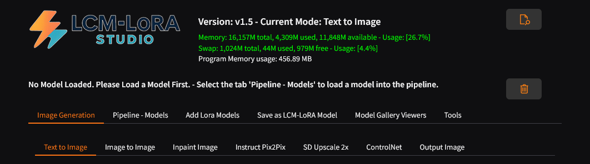
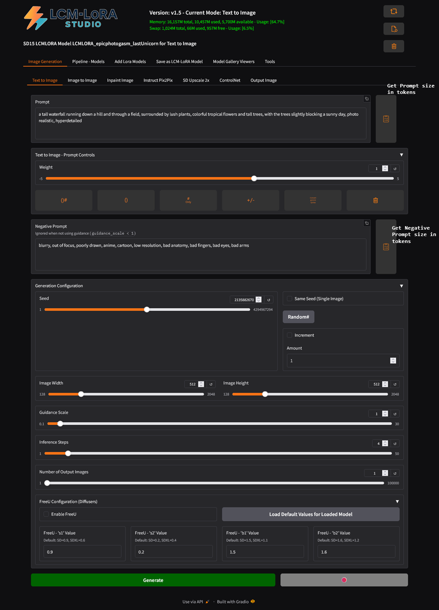
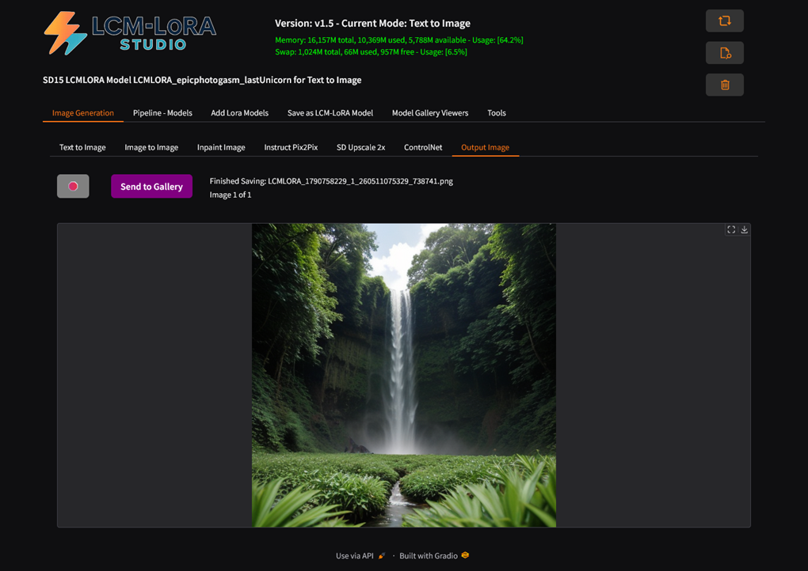
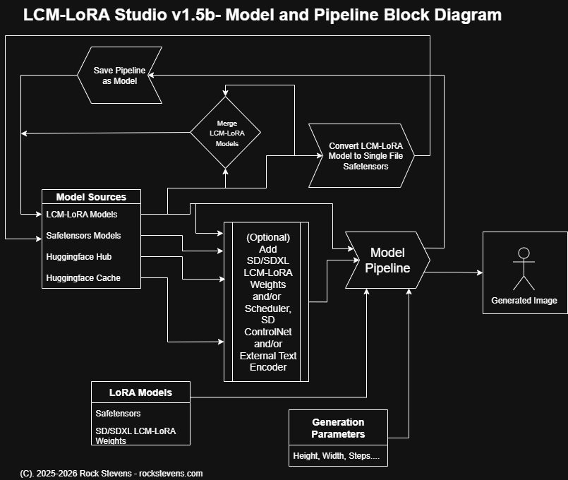

<A id="top"></a>
# LCM-LoRA Studio
 Version 1.5b
  
  
  
<a id="introduction"></a>
## Introduction


UPDATE: 05-09-2026 Runs on Raspberry Pi 5 OS with 8 GB RAM !!. See below for details. (MUST USE the 'lite' version for 8GB PI5)

UPDATE: 05-15-2026 (V1.5a) Added: Save LCM-LoRA Models as Single File Safetensors Models (SD/SDXL), Load separate Text Encoder for Safetensors Models (SD Only).

UPDATE: 05-21-2026 (V1.5b) Block Weighted Model Merging (SD/SDXL). With Presets, plus Load and Save Custom Weight profiles.


***Create a high-quality image, in an average of ONLY 4 STEPS, using just a low-end CPU or a Raspberry Pi 5.***  
  
At it's basic core it generates images using common 
StableDiffusion techniques. However add an LCM-LoRA to the base model and this enables a 4 Step inference 
to generate images. This shorter number of steps allows us to generate images faster than the nomal 20-50 
step de-noising process. LCM-LoRA Studio was mainly written for PC's with no good GPU, and the Raspberry Pi 5 as a first step, in order to reduce inference time while still generating high-quality images.  
And to create special LoRA 'baked-in' types of models, in an, 'all-in-one' application.   

**Advantages:**
* Greatly reduces image generation time.
* Save loaded Pipeline as a New Model.
* Works with most existing fine-tuned Stable Diffusion SD/SDXL models, including custom checkpoints and other LoRAs.
* Can be used with other LoRAs to generate specific styles or add structural guidance.
* Can function 100% Offline ! (Once you have downloaded all the needed models.)
* CPU ONLY ! 
* With just a Raspberry Pi 5 (8GB or 16GB version) -OR- a modest PC computer with 16G RAM. You can generate great looking images.
  
  
**Design:**  
This app is designed to address these issues that exist.  
1. I do not have a good GPU.  
2. I do not have a high-end PC with tons of RAM.  
3. I do not have a high-end PC to shove a good GPU into, if I had one. 
  
<a id="qindex"></a>
## Quick Index
* [Introduction](#introduction)
* [Quick Index](#qindex)
* [YouTube Videos](#youtube)
* [Text to Image Screenshot](#t2ishot)
* [Output Image Screenshot](#outshot)
* [Summary](#summary)
* [Block Diagram Model - Pipeline](#block-diagram)
* [LCM-LoRA Studio Features](#features)
* [Performance](#performance)
* [Requirements](#requirements)
* [Installation](#installation)
* [Run](#run)
* [Run (LOOP) Version](#loop-version)
* [Acknowledgements / Credits](#credits)
* [Disclaimer](#disclaimer)
* [License](#license)

---

<a id="youtube"></a>
### YouTube Videos 

[Install of LCM-LoRA-Studio on a Raspberry Pi 5](https://youtu.be/PXEmXvmkqdQ)  
[Realtime Run of LCM-LoRA-Studio on a Raspberry Pi 5 from Command Line](https://youtu.be/0nEvR0uNlMo)  
[Demo of the Restart feature in LCM-LoRA-Studio on a Raspberry Pi 5](https://youtu.be/pGscdxQ_vGA)  
[Install of LCM-LoRA-Studio on Windows](https://youtu.be/8WwrtT_DEMc)  
[First Run of LCM-LoRA-Studio on Windows](https://youtu.be/4AfTc6sMogY)  

<br>

[Back to Top](#top) | [Quick Index](#qindex)

<a id="t2ishot"></a>
### Text to Image Screenshot 


<br>

[Back to Top](#top) | [Quick Index](#qindex)


<a id="outshot"></a>
### Output Image Screenshot

<br>

[Back to Top](#top) | [Quick Index](#qindex)

---

<a id="summary"></a>
## Summary
In essence, Load a SD/SDXL model into the LCM-LoRA Studio 'Pipeline', add the LCM-LoRA Weight to the 'Pipeline', 
then you can generate an image in ONLY 4 STEPS. Then, if you like the results, 
Save the 'Pipeline' as a New LCM-LoRA Model. Or add additional LoRA models for various fine-tuning tasks, 
and Save that model as well.   
See the block diagram below.

<a id="block-diagram"></a>
## Block Diagram Model - Pipeline



<br>

[Back to Top](#top) | [Quick Index](#qindex)


<a id="features"></a>
## LCM-LoRA Studio Features

**Image Generation (SD/SDXL)**
* Text to Image
* Image to Image
* Inpainting
* Instruct Pix2Pix
* Image Upscaling - SD Upscaler 2x
* SD ControlNet (*Use up to two ControlNets at once !!) MLSD Line Detection, HED Edge Detection, Depth Estimation, Scribble, Canny, Normal Map Estimation, Image Segmentation and OpenPose.*)  

  
**Prompts**
* Both Prompt and Negative prompt inputs.
* Embedded Prompts (Can be adjusted in settings.)
* Prompt Weighting (uses the 'Compel' prompt weight library, also can be adjusted in settings.)
* Prompt token length checking.


**General Image Generation**
* Live Inference Progress Bar During Generation. Shows Time, Current Inference Step.
* Access the Diffusers 'FreeU' configuration settings, to tweak for various generation changes.
* Seed - Single Images: Start on the selected seed, Start on a random seed.
* Seed - Multiple Images: Same as Single Image -OR- increment seed up or down by X amount.
* Generate a LARGE number of images when Generating Multiple Images.
* Clip Skip (SD)
* Uses Safety Checker via an Image Classification Model. (which can be disabled in settings if needed)
* Auto Jump to 'Output Image Tab' when you click the 'Generate' button.
* Saves Generation text-parameter file with generated image (PNG).
* Use Diffusers FreeU settings, which improves image details by rebalancing the UNet's backbone and skip connection weights (Per Diffusers).

  
**Models - Pipeline**
* Load and Save the Model Pipeline. With or without LoRA weights.
* Load SD and SDXL Local Previously Saved LCM-LoRA Models
* Load SD and SDXL Local Huggingface 'Cache' Models - Auto filters out all non SD/SDXL models. (No LLMs, etc...)
* Load SD and SDXL Huggingface Models (You can grab just the files needed, and it will load the model directly into the 'Pipeline', or the 'whole repository')
* Load SD and SDXL Safetensors Models - Single File Safetensors Models - From Huggingface, Civitai etc...
* Load SD and SDXL LoRA Models - Single File Safetensors Models - From Huggingface, Civitai etc...
* Load a seperate text encoder than the loaded model uses. (LCM-LoRA and Safetensors, SD Only)</li>
* Use 'Reference' Models and/or 'Original Config' Files when Loading Safetensors Model files to guide loading. (See settings)
* Save LCM-LoRA Models to (Single File) Safetensors Models. (Compatible with A1111 if using an LCM Scheduler)
* Turn On/Off LCM Scheduler at key points.
* Block Weighted Model Merging (SD/SDXL). With Presets, plus Load and Save Custom Weight profiles.

**LoRA**
* Load the LCM-LoRA Weights and then save the Pipeline as an LCM-LoRA Model for the faster '4 step inference'.
* Auto (optional) Load/Apply the LCM-LoRA Weights when loading models, or Load without the LCM-LoRA Weights.
* Load (Add) 'multiple' LoRAs directly into the pipeline.
* Change any loaded LoRAs weights, individualy.
* "Bake" or "Merge" a LoRA into the Pipeline, then Save as an LCM-LoRA Model.

**General Features**

* 'Simple OpenPose Editor' Opens in a new window (tab). 100% Offline, Pure HTML/JavaScript. Saves PNG images for use with  OpenPose/ControlNet.
* Multi-Step Image Proccessing Section 
* Tweak/Enhance Images Before and/or After Generation). Including: Adjust Brightness, Contrast, Color, Individual R/G/B Weight on Images
* Convert to Grayscale - Adjusting Upper/Lower Thresholds, Individual R/G/B Weights, Invert GrayScale
* Post Processing Edge Detection (Use for some of the ControlNets). Canny, Laplacian, Scharr, Sobel, Simple Gradient, Prewitt, Roberts Cross.
* Processed Output Image can be Inverted as well as apply Sharpening.
* Save processed image at any step.
* Apply Gaussian, Horizontal and/or Vertical Motion Blur at any stage of image processing.
* Send Proccessed Output Image Directly to either of the 2 ControlNet Image Input controls. (Then Switches to the ControlNet Tab.)
* Access many 'Settings' which control LCM-LoRA Studio, as well as some of the backend and how models are loaded/handled.
* Memory and Swap Space Display. (Always visible.)

<br>

**Programmers/Hacking Features**<br>
* Very easy to add settings to program, see 'config.py'
* Choose between Textbox, Slider, Number, Checkbox, HTML and Label as 'Input' types in the Setting UI.
* Written as an example of 'simple python coding' image generation. Basically in a 'canned code' type format like some compilers I've written. 
* Lots of comments throughout. (unless kinda obvious what it does.)
<br>

[Back to Top](#top) | [Quick Index](#qindex)

 
---

<a id="performance"></a>  
## Performance

**Model**: Original Stable Diffusion Base (SD) v1.5  
**LoRA**: SD15 LCM-LoRA added to model with weight of 1.0  
**Image Size**: 512 x 512   
**CFG**: 1.0  
**Prompts**: Normal, no embedded prompts.  
<br>

NOTE: On an 8GB Raspberry Pi 5 you can only do SD. SDXL models are too big for just 8GB of RAM.


| Operating System  | CPU                                   | RAM | Storage Type      | Time per iter | Total time | SD Model / Prec          |
|-------------------|---------------------------------------|-----|-------------------|---------------|------------|--------------------------|
| Windows 10 Pro    | Intel(R) Core(TM) i5-12500T @ 2.00GHz | 16G | USB 3.0 FLASH     | 6.34 s/it     | 48 s       | LCM-LoRA / FP16          |
| Windows 11 Pro    | Intel(R) N95 @ (1.70 GHz)             | 16G | USB 3.0 SSD       | 8.04 s/it     | 53 s       | LCM-LoRA / FP16          | 
| Raspberry Pi OS   | Raspberry Pi 5                        |  8G | Class10 SDCARD    | 13.75s/it     | 90 s       | LCM-LoRA / FP16 (SD Only)|
| Raspberry Pi OS   | Raspberry Pi 5                        | 16G | PCIe 2.0 NVMe SSD | 13.19s/it     | 71 s       | LCM-LoRA / FP16          |

*Inference time and RAM usage always goes up if there is an increase in, Image Size or CFG Scale, and SDXL models always take longer than SD models.*   
*'Time per iter' comes from the 'diffusers' progress bar.*  
*'Total time' comes from LCM-LoRA Studio. Starts when inference begins, Stops once the image is saved. So that includes 'decoding' the image.*  


<br>

[Back to Top](#top) | [Quick Index](#qindex)

  
---

<a id="requirements"></a>
## Requirements

To install, ensure you are connected to the internet for installation of Python packages not in your pip cache, etc... 
Then later of course to download models, after that, it can work 100% Offline.  

* Good Internet Connection
* Windows 10 or higher, Raspberry Pi 5 OS (Linux) Tested on Bookworm 2024-11-19 thru Trixie 2026-04-21 (MUST USE the 'lite' version for 8GB PI5)
* Minimum Python version 3.10.8 (NOTE: Installer does not check version, only if Python exists)
* CPU system with at least 16GB of RAM -or- Raspberry Pi 5 with 8GB or 16GB RAM.
* Modern web browser for the user interface.
* LOTS of free storage space, mainly for models and images.


<br>

[Back to Top](#top) | [Quick Index](#qindex)

 
---

<a id="installation"></a>
## Installation

* Download LCM-LoRA-Studio from GitHub, and unzip to a folder where you want it installed. NOTE: The install WILL create a python virtual enviroment to install all of the packages, so it doesn't trash your system.

<br>

#### Windows Install

LCM-LoRA Studio can be installed right from Explorer.  
Just navigate to the LCM-LoRA Studio folder and double-click:

```commandline
install.bat
```

<br>

#### Raspberry Pi 5 Install

Use the Raspberry Pi Imager tool to make an image onto an SD Card of Trixie-Lite Release 4-21-2026.

We use Trixie-Lite Release 4-21-2026, because it uses least amount of RAM.

Set up as you normally would, but we are going to be setting it up for 'headless' operation. So make sure to Enable SSH.

When done. Put SD Card in Pi5. Boot the Pi5.

Open a terminal (SSH/Putty) and Login.

The 'lite' version of Raspberry Pi OS needs the transitional dummy package: 'libgl1-mesa-dev' used by Python-OpenCV2, since you will be using the Pi 'headless'.


In the terminal type the following 2 command lines:

```shell
sudo apt-get update
sudo apt-get install libgl1-mesa-dev
```

Now, you will need to finish configuring your Raspberry Pi 5 via 'raspi-config'.

In the terminal type the following:


```shell
sudo raspi-config
```

Now configure your Pi5 to:

1. Go to the console on boot
2. NOT auto login.
3. Turn OFF the Administrator password needed for 'sudo (*We'll be able to remote boot and shutdown from the GUI*)


Exit raspi-config. 

Reboot.

Open a terminal (SSH/Putty) and Log back in.

Now that we have installed the all of the requirements needed, we can install LCM-LoRA Studio.

If you prefer using 'git', you'll have to install it. It does not come with Trixie Lite, but we do not need it, so let's continue.</p>

In the terminal type the following commands:

```shell
cd
wget -O lcm-lora-studio.zip https://github.com/rock-stevens/lcm-lora-studio/archive/refs/heads/main.zip
unzip lcm-lora-studio.zip
mv lcm-lora-studio-main lcm-lora-studio
```


Navigate to the directory you unzipped 'LCM-LoRA Studio' to.  

```shell
cd lcm-lora-studio
```


In the terminal type the following commands to start installing LCM-LoRA Studio:

```shell
chmod +x *.sh
./install.sh
```


<br>

On both Windows and the Raspberry Pi 5, LCM-LoRA Studio installer will install the needed Python packages in order to run the app.  
After installation of all of the packages, LCM-LoRA Studio will be ready to run.

<br>

[Back to Top](#top) | [Quick Index](#qindex)


---

<a id="run"></a>
## Run LCM-LoRA Studio

<br>

#### Run Windows Version
To Run LCM-LoRA Studio, it is the same as the installation, from Explorer.  
Just navigate to the LCM-LoRA Studio folder, but double-click:

```commandline
run.bat
```

<br>


#### Run Raspberry Pi 5 Version
To Run LCM-LoRA Studio, In the terminal type the following command line:

```shell
./run.sh
```

<br>

[Back to Top](#top) | [Quick Index](#qindex)


---

<a id="loop-version"></a>
## Run (LOOP) Version
To Run LCM-LoRA Studio, in a LOOP, on Windows, you can start it from Explorer.  
Just navigate to the LCM-LoRA Studio folder and double-click:


```commandline
restart.bat
```

<br>


To Run LCM-LoRA Studio, in a LOOP, on a Raspberry Pi 5  
In the terminal type the following command line:

```shell
./restart.sh
```

<br>
  
  
About the Run LOOP method of starting LCM-LoRA Studio.  
You can:  
* Exit or Restart Python from the UI (Windows and Pi5). Reboot or Shutdown(Pi5 Only). Great for a remote Pi5.
* Turn ON/OFF Huggingface Hub, for 100% offline.
* You can also modify the 'restart.sh' or 'restart.bat' files to force a particular default state on startup.  
   
Note: With or without running LCM-LoRA Studio, via 'run' or 'restart' there is an Exit button in the App, try it.  


<br>

[Back to Top](#top) | [Quick Index](#qindex)


---

<a id="credits"></a>
## Acknowledgements / Credits

* Original implementation of Stable Diffusion: https://github.com/CompVis/stable-diffusion 
* Diffusers Library: https://github.com/huggingface/diffusers 
* Huggingface (Lots of Models, Example code, Documention, etc...) : https://huggingface.co/ 
* Civitai (Lot of Base models and LoRA models) : https://civitai.com/ 
* Compel - A text prompt weighting and blending library for transformers-type text embedding systems : https://github.com/damian0815/compel 

**Models used**:  
* stabilityai/sd-x2-latent-upscaler - Stable Diffusion x2 latent upscaler : https://huggingface.co/stabilityai/sd-x2-latent-upscaler  

  
**Latent Consistency Models (LCM) LoRA** :  
A universal Stable-Diffusion Acceleration Module by: Simian Luo, Yiqin Tan, Suraj Patil, Daniel Gu et al. : https://huggingface.co/latent-consistency  
* SD Model: latent-consistency/lcm-lora-sdv1-5  : https://huggingface.co/latent-consistency/lcm-lora-sdv1-5  
* SDXL Model: latent-consistency/lcm-lora-sdxl : https://huggingface.co/latent-consistency/lcm-lora-sdxl  

  
**ControlNet**:  
ControlNet : https://huggingface.co/lllyasviel  
Github: https://github.com/lllyasviel/ControlNet   
Read the ControlNet Blog for more: https://huggingface.co/blog/controlnet  

**ControlNet Models used**:  
MLSD Line Detection: lllyasviel/sd-controlnet-mlsd : https://huggingface.co/lllyasviel/sd-controlnet-mlsd  
HED Edge Detection: lllyasviel/sd-controlnet-hed : https://huggingface.co/lllyasviel/sd-controlnet-hed  
Depth Estimation: lllyasviel/sd-controlnet-depth : https://huggingface.co/lllyasviel/sd-controlnet-depth  
Scribble: lllyasviel/sd-controlnet-scribble : https://huggingface.co/lllyasviel/sd-controlnet-scribble  
Canny: lllyasviel/sd-controlnet-canny : https://huggingface.co/lllyasviel/sd-controlnet-canny  
Normal Map Estimation: lllyasviel/sd-controlnet-normal : https://huggingface.co/lllyasviel/sd-controlnet-normal  
Image Segmentation: lllyasviel/sd-controlnet-seg : https://huggingface.co/lllyasviel/sd-controlnet-seg  
OpenPose: lllyasviel/sd-controlnet-openpose : https://huggingface.co/lllyasviel/sd-controlnet-openpose  


**PyTorch - Linux Memory Fix**:  
Brian, of Gridline Productions, for the 'PyTorch Memory Fix' : https://github.com/brjen/pytorch-memory-fix


**Other Thanks**:  
My Wife, who left me alone... with quiet... long enough to finish.


<br>

[Back to Top](#top) | [Quick Index](#qindex)


---

<a id="disclaimer"></a>
## Disclaimer

Do NOT use this project in any way to produce illegal, harmful or offensive content.  
The author is NOT responsible for ANY content generated using this project, not limited to just models and images.  

<br>

[Back to Top](#top) | [Quick Index](#qindex)


---

<a id="license"></a>
## License

Licensed under the Apache License, Version 2.0  

---

Thanks for trying LCM-LoRA Studio.  

Feel free to use, install, share, hack and enjoy !  

Copyright (C) 2025-present [Rock Stevens](https://rockstevens.com)


<br>

[Back to Top](#top) | [Quick Index](#qindex)

